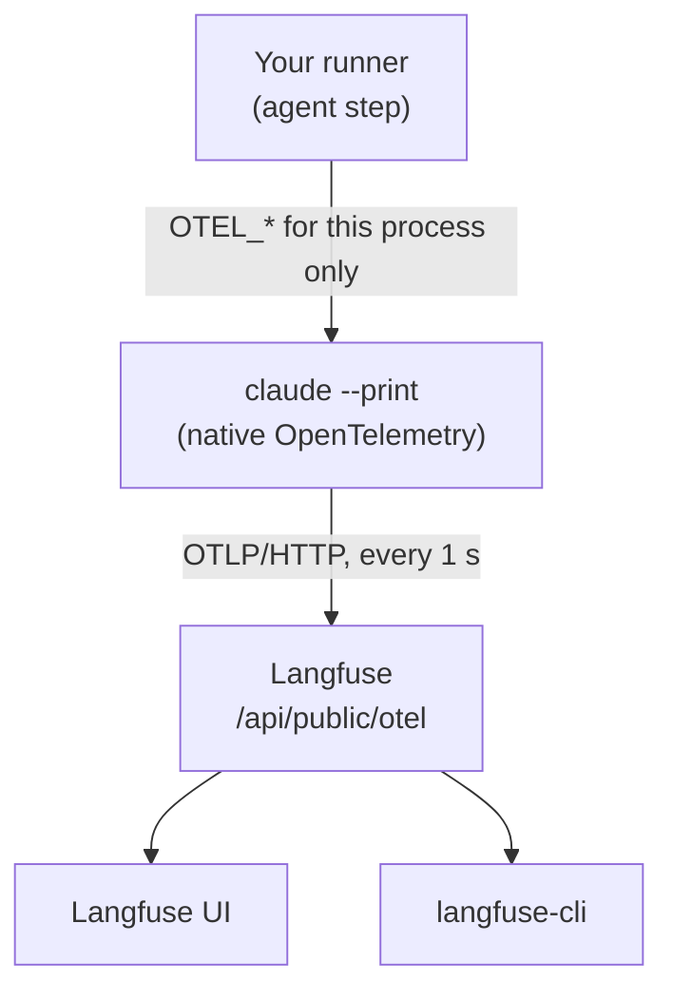

# Notes Collection Implementation Plan

> **For Claude:** REQUIRED SUB-SKILL: Use superpowers:executing-plans to implement this plan task-by-task.

**Goal:** Add a Markdown/MDX `notes` collection (a blog with attachments) to workflows.doruk.uk.
Publish a generalized Langfuse tracing note as its first entry.

**Architecture:** Astro Content Collections load `src/content/notes/<slug>/index.{md,mdx}`, and a
Zod schema checks them. Static routes render the index, tag, note, and RSS pages. The existing
`check-site.mjs` post-build check gets assertions for the note routes and a disclosure scan, which
is a pure, unit-tested module.

**Tech Stack:** Astro 7.3.3, `@astrojs/mdx` 8.0.2, `@astrojs/rss` 4.0.19, `node:test`, and
`@mermaid-js/mermaid-cli` for author-time diagrams only.

**Design:** [2026-10-05-notes-collection-design.md](2026-10-05-notes-collection-design.md)

**Conventions:**

- Work on branch `feat/notes-collection` in this repository. Do not create worktrees.
- Match the surrounding code. `check-site.mjs` uses terse `assert` lines. Astro pages are compact.
- The red/green loop is `npm run verify`. A new assertion must fail before you add the code that
  makes it pass.
- Commit with Conventional Commits. Do not bump the version. Release Please does that.

---

### Task 1: Disclosure scanner (pure module, unit tested)

**Files:**
- Create: `scripts/disclosure.mjs`
- Create: `scripts/disclosure-rules.json`
- Test: `scripts/disclosure.test.mjs`
- Modify: `package.json` (`scripts`)

**Step 1: Write the failing test**

`scripts/disclosure.test.mjs`:

```js
import { test } from 'node:test';
import assert from 'node:assert/strict';
import { loadRules, scanText } from './disclosure.mjs';

const rules = loadRules(new URL('./disclosure-rules.json', import.meta.url));
const ids = text => scanText(text, rules).map(f => f.id);

test('flags employer and secret-manager names case-insensitively', () => {
  assert.deepEqual(ids('Stored in infisical for AdCreative-ai'), ['employer-name', 'secret-manager']);
});
test('flags ticket keys, CI run URLs, secret commands, and emails', () => {
  assert.deepEqual(ids('ATT-1234'), ['ticket-key']);
  assert.deepEqual(ids('https://github.com/o/r/actions/runs/12345678901'), ['ci-run-url']);
  assert.deepEqual(ids('gh secret set TOKEN'), ['secret-command']);
  assert.deepEqual(ids('mail jane.doe@example.org'), ['email']);
});
test('does not flag ordinary technical text', () => {
  assert.deepEqual(ids('UTF-8, ADR-style notes, npx langfuse-cli@1.2.3, user.email, @astrojs/mdx'), []);
});
test('reports 1-based line numbers and the matched text', () => {
  assert.deepEqual(scanText('ok\nsee ATT-12 here', rules), [{ id: 'ticket-key', line: 2, match: 'ATT-12' }]);
});
```

**Step 2: Run the test and confirm that it fails**

Run: `node --test "scripts/*.test.mjs"`
Expected: FAIL with `Cannot find module '.../scripts/disclosure.mjs'`.

**Step 3: Write the minimal implementation**

`scripts/disclosure-rules.json`:

```json
[
  { "id": "employer-name", "pattern": "adcreative|appier", "flags": "i" },
  { "id": "secret-manager", "pattern": "infisical", "flags": "i" },
  { "id": "secret-command", "pattern": "gh secret set", "flags": "i" },
  { "id": "ticket-key", "pattern": "\\bATT-\\d+\\b" },
  { "id": "ci-run-url", "pattern": "/actions/runs/\\d+" },
  { "id": "email", "pattern": "[A-Za-z0-9._%+-]+@[A-Za-z0-9-]+(?:\\.[A-Za-z0-9-]+)*\\.[A-Za-z]{2,}\\b" }
]
```

`scripts/disclosure.mjs`:

```js
import { readFileSync } from 'node:fs';
export const loadRules=path=>JSON.parse(readFileSync(path,'utf8')).map(r=>({id:r.id,re:new RegExp(r.pattern,'g'+(r.flags??'').replace('g',''))}));
export function scanText(text,rules){
 const findings=[];
 text.split('\n').forEach((line,i)=>{for(const r of rules) for(const m of line.matchAll(r.re)) findings.push({id:r.id,line:i+1,match:m[0]})});
 return findings;
}
```

In `package.json` `scripts`, add `"test": "node --test \"scripts/*.test.mjs\""`. Change `verify`
to `"npm test && npm run build && node scripts/check-site.mjs"`. Node 24 does not discover tests
from a bare directory argument, so the script uses an explicit glob.

**Step 4: Run the tests and confirm that they pass**

Run: `npm test`
Expected: PASS, 4 tests. (A fifth test, for `g` flags, was added during review.)

If `ids()` returns rules in a different order than the first test expects, keep the order that
follows the rule file. The scan is line-major, then rule-major. Fix the test expectation, not the
scan order.

**Step 5: Commit**

```bash
git add scripts/disclosure.mjs scripts/disclosure-rules.json scripts/disclosure.test.mjs package.json
git commit -m "test: add disclosure scanner for notes"
```

---

### Task 2: Install MDX and RSS

**Files:**
- Modify: `package.json`, `package-lock.json`
- Modify: `astro.config.mjs`

**Step 1: Install the exact versions**

Run: `npm install --save-exact @astrojs/mdx@8.0.2 @astrojs/rss@4.0.19`
Expected: both are added to `dependencies`, with no peer-dependency errors.
(`@astrojs/markdown-remark` is an optional peer of mdx.)

**Step 2: Register the integration**

`astro.config.mjs`:

```js
import { defineConfig } from 'astro/config';
import mdx from '@astrojs/mdx';
export default defineConfig({ site: 'https://workflows.doruk.uk', output: 'static', trailingSlash: 'always', integrations: [mdx()] });
```

**Step 3: Verify that nothing regressed**

Run: `npm run verify`
Expected: PASS with the same page count as before (`Verified N pages, ...`). Write N down.

**Step 4: Commit**

```bash
git add package.json package-lock.json astro.config.mjs
git commit -m "build: add MDX and RSS integrations"
```

---

### Task 3: Notes collection, schema, and index page

**Files:**
- Create: `src/content.config.ts`
- Create: `src/lib/notes.ts`
- Create: `src/components/NoteCard.astro`
- Create: `src/pages/notes/index.astro`
- Create: `src/content/notes/langfuse-tracing-claude-code/index.mdx` (frontmatter and intro only)
- Modify: `scripts/check-site.mjs`
- Modify: `src/styles/global.css`

**Step 1: Write the failing check**

In `scripts/check-site.mjs`, after the `slugs`/tools block, add a source-note inventory and the
index assertions:

```js
const notesDir='src/content/notes';
const frontmatter=file=>(readFileSync(file,'utf8').match(/^---\n([\s\S]*?)\n---/)||[,''])[1];
const notes=existsSync(notesDir)?readdirSync(notesDir).flatMap(slug=>{const file=['index.mdx','index.md'].map(n=>join(notesDir,slug,n)).find(existsSync);return file?[{slug,draft:/^draft:\s*true\s*$/m.test(frontmatter(file))}]:[]}):[];
const published=notes.filter(n=>!n.draft);
for(const n of notes) assert.ok(!['tags','rss.xml'].includes(n.slug),'Reserved note slug: '+n.slug);
assert.ok(existsSync(join(root,'notes/index.html')),'Missing notes index');
for(const n of published) assert.ok(readFileSync(join(root,'notes/index.html'),'utf8').includes('href="/notes/'+n.slug+'/"'),'Notes index omits '+n.slug);
```

Also change the personal-path filter from `/\.(json|md|astro)$/` to `/\.(json|mdx?|astro)$/`.

Create the note's frontmatter, so there is something to list:

`src/content/notes/langfuse-tracing-claude-code/index.mdx`:

```mdx
---
title: Tracing Claude Code runs with Langfuse
summary: See where an unattended agent run spends its time, using Claude Code's built-in OpenTelemetry export and a self-hosted Langfuse.
date: 2026-10-05
tags: [langfuse, observability, claude-code]
source: Generalized from private work notes, October 2026.
---

An unattended agent run that takes twelve minutes tells you nothing about why. This note explains how to get a timed trace of each model request and tool call, and how to read it.
```

**Step 2: Run the check and confirm that it fails**

Run: `npm run verify`
Expected: FAIL with `Missing notes index`.

**Step 3: Write the minimal implementation**

`src/content.config.ts`:

```ts
import { defineCollection } from 'astro:content';
import { glob } from 'astro/loaders';
import { z } from 'astro/zod';

const tag = z.string().regex(/^[a-z0-9]+(?:-[a-z0-9]+)*$/, 'Use lowercase kebab-case tags');
const notes = defineCollection({
  loader: glob({ pattern: '*/index.{md,mdx}', base: './src/content/notes', generateId: ({ entry }) => entry.split('/')[0] }),
  schema: z.object({
    title: z.string().min(1),
    summary: z.string().min(1),
    date: z.coerce.date(),
    updated: z.coerce.date().optional(),
    tags: z.array(tag).min(1),
    source: z.string().optional(),
    draft: z.boolean().default(false),
  }),
});
export const collections = { notes };
```

`src/lib/notes.ts`:

```ts
import { getCollection, type CollectionEntry } from 'astro:content';

export type Note = CollectionEntry<'notes'>;
export async function publishedNotes(): Promise<Note[]> {
  const notes = await getCollection('notes', ({ data }) => import.meta.env.DEV || !data.draft);
  return notes.sort((a, b) => b.data.date.valueOf() - a.data.date.valueOf() || a.id.localeCompare(b.id));
}
export const noteTags = (notes: Note[]) => [...new Set(notes.flatMap(n => n.data.tags))].sort();
export const formatDate = (d: Date) => d.toLocaleDateString('en-GB', { day: 'numeric', month: 'short', year: 'numeric', timeZone: 'UTC' });
```

`src/components/NoteCard.astro`:

```astro
---
import { formatDate, type Note } from '../lib/notes';
interface Props { note: Note }
const { note } = Astro.props;
---
<a class="guide-teaser" href={`/notes/${note.id}/`}><span class="eyebrow"><time datetime={note.data.date.toISOString()}>{formatDate(note.data.date)}</time> · {note.data.tags.join(' · ')}</span><h3>{note.data.title}</h3><p>{note.data.summary}</p><span class="go">Read the note ↗</span></a>
```

`src/pages/notes/index.astro`:

```astro
---
import Base from '../../layouts/Base.astro';
import NoteCard from '../../components/NoteCard.astro';
import { publishedNotes, noteTags } from '../../lib/notes';
const notes = await publishedNotes();
---
<Base title="Notes" description="Learned experience from building and running agent workflows: setups, diagnoses, and what worked."><div class="shell"><div class="page-head"><div class="eyebrow">Notes</div><h1>What the work<br /><em>taught us.</em></h1><p class="lead">Setups, diagnoses, and lessons from building and running agent workflows.</p><div class="tag-list">{noteTags(notes).map(t => <a class="badge" href={`/notes/tags/${t}/`}>{t}</a>)}</div></div><div class="guide-grid">{notes.map(note => <NoteCard note={note} />)}</div></div></Base>
```

Append to `src/styles/global.css`, as a new line after the main rule line and before the
`@media` line:

```css
.tag-list{display:flex;flex-wrap:wrap;gap:8px;margin-top:22px}.tag-list .badge{text-decoration:none}.prose img{max-width:100%;height:auto;border-radius:5px}
```

The tag links will not resolve yet. Before you rerun the check, finish Task 4, or temporarily
leave the tag list out. The recommended order is Step 4, then Task 4, then the commit for both.

**Step 4: Check the schema rejects bad frontmatter (negative check)**

Temporarily change the note's `tags` to `[Langfuse]`. Then run `npm run build`.
Expected: the build FAILS with `Use lowercase kebab-case tags`. Revert the change.

**Step 5: Commit (after Task 4 is green)**

```bash
git add src/content.config.ts src/lib/notes.ts src/components/NoteCard.astro src/pages/notes/index.astro src/content/notes src/styles/global.css scripts/check-site.mjs
git commit -m "feat(notes): add notes collection and index"
```

---

### Task 4: Note pages and tag pages

**Files:**
- Create: `src/layouts/Note.astro`
- Create: `src/pages/notes/[slug].astro`
- Create: `src/pages/notes/tags/[tag].astro`
- Modify: `scripts/check-site.mjs`

**Step 1: Write the failing check**

Add the following after the notes-index assertions:

```js
for(const n of published) assert.ok(existsSync(join(root,'notes',n.slug,'index.html')),'Missing note page '+n.slug);
for(const n of notes.filter(n=>n.draft)) assert.ok(!existsSync(join(root,'notes',n.slug)),'Draft note was built: '+n.slug);
```

The existing local-link walker already fails on any `/notes/tags/<tag>/` link without a page.

**Step 2: Run the check and confirm that it fails**

Run: `npm run verify`
Expected: FAIL with `Missing local target /notes/tags/claude-code/` or
`Missing note page langfuse-tracing-claude-code`.

**Step 3: Write the minimal implementation**

`src/layouts/Note.astro`:

```astro
---
import Base from './Base.astro';
import { formatDate, type Note } from '../lib/notes';
interface Props { note: Note }
const { title, summary, date, updated, tags, source } = Astro.props.note.data;
---
<Base title={title} description={summary}><article class="article shell"><header class="page-head"><div class="breadcrumb"><a href="/notes/">Notes</a> / {tags[0]}</div><div class="eyebrow"><time datetime={date.toISOString()}>{formatDate(date)}</time>{updated && <> · Updated <time datetime={updated.toISOString()}>{formatDate(updated)}</time></>}</div><h1>{title}</h1><p class="lead">{summary}</p><div class="tag-list">{tags.map(t => <a class="badge" href={`/notes/tags/${t}/`}>{t}</a>)}</div></header><div class="prose"><slot />{source && <p class="reference-note">Source: {source}</p>}</div></article></Base>
```

`src/pages/notes/[slug].astro`:

```astro
---
import { render } from 'astro:content';
import Note from '../../layouts/Note.astro';
import { publishedNotes } from '../../lib/notes';
export async function getStaticPaths() {
  return (await publishedNotes()).map(note => ({ params: { slug: note.id }, props: { note } }));
}
const { note } = Astro.props;
const { Content } = await render(note);
---
<Note note={note}><Content /></Note>
```

`src/pages/notes/tags/[tag].astro`:

```astro
---
import Base from '../../../layouts/Base.astro';
import NoteCard from '../../../components/NoteCard.astro';
import { publishedNotes, noteTags } from '../../../lib/notes';
export async function getStaticPaths() {
  const notes = await publishedNotes();
  return noteTags(notes).map(tag => ({ params: { tag }, props: { notes: notes.filter(n => n.data.tags.includes(tag)) } }));
}
const { tag } = Astro.params;
const { notes } = Astro.props;
---
<Base title={`Notes tagged ${tag}`} description={`Notes about ${tag} from building and running agent workflows.`}><div class="shell"><div class="page-head"><div class="breadcrumb"><a href="/notes/">Notes</a> / Tag</div><h1>{tag}</h1><p class="lead">{notes.length} {notes.length === 1 ? 'note' : 'notes'}.</p></div><div class="guide-grid">{notes.map(note => <NoteCard note={note} />)}</div></div></Base>
```

**Step 4: Run the check and confirm that it passes**

Run: `npm run verify`
Expected: PASS, with N + 5 pages (index, note, and three tag pages).

**Step 5: Check drafts (negative check)**

Temporarily add `draft: true` to the note. Run `npm run verify`.
Expected: the index has no card, and no `/notes/langfuse-tracing-claude-code/` page exists.
Because the note has no published sibling, the build has no tag pages, and the check passes. Then
run `npm run dev` and confirm that `/notes/langfuse-tracing-claude-code/` renders in development.
Revert the change.

**Step 6: Commit Tasks 3 and 4**

Use the Task 3 commit command and add `src/layouts/Note.astro src/pages/notes`.

---

### Task 5: RSS feed, sitemap, and navigation

**Files:**
- Create: `src/pages/notes/rss.xml.ts`
- Modify: `src/pages/sitemap.xml.ts`
- Modify: `src/layouts/Base.astro`
- Modify: `scripts/check-site.mjs`

**Step 1: Write the failing check**

Add:

```js
const feed=readFileSync(join(root,'notes/rss.xml'),'utf8');
const sitemap=readFileSync(join(root,'sitemap.xml'),'utf8');
for(const n of published){const url='https://workflows.doruk.uk/notes/'+n.slug+'/';assert.ok(feed.includes(url),'RSS omits '+n.slug);assert.ok(sitemap.includes('<loc>'+url+'</loc>'),'Sitemap omits '+n.slug)}
assert.ok(sitemap.includes('<loc>https://workflows.doruk.uk/notes/</loc>'),'Sitemap omits notes index');
```

**Step 2: Run the check and confirm that it fails**

Run: `npm run verify`
Expected: FAIL with `ENOENT ... notes/rss.xml`.

**Step 3: Write the minimal implementation**

`src/pages/notes/rss.xml.ts`:

```ts
import rss from '@astrojs/rss';
import type { APIContext } from 'astro';
import { publishedNotes } from '../../lib/notes';

export async function GET(context: APIContext) {
  const notes = await publishedNotes();
  return rss({
    title: 'Agent Workflows notes',
    description: 'Learned experience from building and running agent workflows.',
    site: context.site!,
    trailingSlash: true,
    items: notes.map(n => ({ title: n.data.title, description: n.data.summary, pubDate: n.data.date, link: `/notes/${n.id}/`, categories: n.data.tags })),
  });
}
```

`src/pages/sitemap.xml.ts`: make `GET` async and add the note paths:

```ts
import tools from '../data/tools.json';
import { publishedNotes, noteTags } from '../lib/notes';
export async function GET(){const notes=await publishedNotes();const paths=['/','/tools/','/guides/','/guides/jira-to-reviewed-report/','/notes/',...notes.map(n=>'/notes/'+n.id+'/'),...noteTags(notes).map(t=>'/notes/tags/'+t+'/'),'/map/','/about/',...tools.map(t=>'/tools/'+t.slug+'/')];return new Response('<?xml version="1.0" encoding="UTF-8"?>\n<urlset xmlns="http://www.sitemaps.org/schemas/sitemap/0.9">'+paths.map(p=>'<url><loc>https://workflows.doruk.uk'+p+'</loc></url>').join('')+'</urlset>',{headers:{'Content-Type':'application/xml'}});}
```

`src/layouts/Base.astro`:
- Change the nav to
  `[['/tools/', 'Tools & repos'], ['/guides/', 'Guides'], ['/notes/', 'Notes'], ['/map/', 'System map']]`.
- After the canonical link, add
  `<link rel="alternate" type="application/rss+xml" title="Agent Workflows notes" href="/notes/rss.xml" />`.

**Step 4: Run the check and confirm that it passes**

Run: `npm run verify`
Expected: PASS. The link walker also confirms that `/notes/rss.xml` resolves on every page.

**Step 5: Check the mobile navigation**

Run `npm run dev`. Open `/notes/` at a 375px width, and confirm that the four nav links fit
without horizontal scrolling. The existing rule is `nav{justify-content:space-between}` under
720px. If the links overflow, reduce `nav{gap}` in the existing `@media(max-width:720px)` rule
only.

**Step 6: Commit**

```bash
git add src/pages/notes/rss.xml.ts src/pages/sitemap.xml.ts src/layouts/Base.astro scripts/check-site.mjs
git commit -m "feat(notes): add RSS feed, sitemap entries, and navigation"
```

---

### Task 6: Wire the disclosure scan into the site check

**Files:**
- Modify: `scripts/check-site.mjs`

**Step 1: Write the failing check**

Add an import at the top: `import { loadRules, scanText } from './disclosure.mjs';`. Then add
the following near the personal-path check:

```js
const rules=loadRules(new URL('./disclosure-rules.json',import.meta.url));
for(const file of existsSync(notesDir)?walk(notesDir).filter(p=>/\.(mdx?|mmd|svg|json)$/.test(p)):[]) for(const f of scanText(readFileSync(file,'utf8'),rules)) assert.fail('Disclosure '+f.id+' in '+file+':'+f.line+' ('+f.match+')');
```

To prove that the check works, temporarily add `See ATT-1234.` to the note body.

**Step 2: Run the check and confirm that it fails**

Run: `npm run verify`
Expected: FAIL with
`Disclosure ticket-key in src/content/notes/langfuse-tracing-claude-code/index.mdx:9 (ATT-1234)`.

**Step 3: Remove the planted line and run the check again**

Run: `npm run verify`
Expected: PASS.

**Step 4: Commit**

```bash
git add scripts/check-site.mjs
git commit -m "test(notes): fail the build on private details in notes"
```

---

### Task 7: Write the Langfuse note

**Files:**
- Modify: `src/content/notes/langfuse-tracing-claude-code/index.mdx`
- Create: `src/content/notes/langfuse-tracing-claude-code/trace-pipeline.mmd`
- Create: `src/content/notes/langfuse-tracing-claude-code/trace-pipeline.svg`
- Create: `scripts/mermaid.config.json`
- Create, optionally: cropped screenshots in the same folder

**Inputs (private; read them, never link to them):**
`../agent-workflows/plugins/AC-visual-walkthrough/docs/observability/README.md`,
`diagnose-in-langfuse-ui.md`, `diagnose-with-cli.md`, and `images/01-05`.

**Step 1: Read all three source files completely**

Make a list of each private detail: org and repo names, secret names and paths, Infisical folders,
CI run IDs, tickets, emails, internal hostnames, and ADR links. Each one must be removed or made
generic in the note.

**Step 2: Write the body with this outline**

1. **Why trace an agent run.** Wall time on its own does not separate slow model calls, slow tools,
   and retries.
2. **How it works.** Claude Code makes OpenTelemetry spans itself. The runner sets `OTEL_*`
   environment variables for that one process only. The spans go over OTLP/HTTP to Langfuse's
   `/api/public/otel` endpoint. There is no SDK, hook, collector, or transcript parser. Give the
   exact variables from the source's "turn tracing on" section, with placeholder values
   (`https://langfuse.example.com`, `pk-lf-…`).
3. **What each observation tells you.** The observation table (`claude_code.interaction`,
   `.llm_request`, `.tool`, `.tool.execution`, `.tool.blocked_on_user`) and the useful
   `attributes.*` fields. Add a general tip: put the run identity in `OTEL_RESOURCE_ATTRIBUTES`.
   Use generic names, such as `run.ticket` and `run.target`.
4. **What is and is not exported.** Prompts are redacted, and responses and tool output are not
   sent. Under OAuth, the signed-in account's email and account IDs **are** exported. Present
   this as a privacy lesson.
5. **Diagnose a slow run in the UI.** The steps from `diagnose-in-langfuse-ui.md`, written for a
   generic run.
6. **Diagnose with the CLI.** The `npx langfuse-cli` commands from `diagnose-with-cli.md`, with
   placeholder trace and run IDs. Keep the exact flags.
7. **Lessons.** The non-obvious findings in the sources, such as the interaction span arriving
   last, and step timings outside the agent coming from CI rather than from the trace.

Write in the style of `src/pages/guides/jira-to-reviewed-report.md`: short paragraphs, `##`
sections, and tables where the source has tables. Follow the simple-english skill.

**Step 3: Render the diagram**

`scripts/mermaid.config.json`: `{ "htmlLabels": false, "flowchart": { "htmlLabels": false } }`.
This makes the SVG render inside `` without `foreignObject`. Mermaid 11 needs the top-level
`htmlLabels` key for node labels.

`trace-pipeline.mmd` is a generalized version of the source flowchart:



Run (this downloads Chromium to the npx cache once):
`npx -y @mermaid-js/mermaid-cli@11 -c scripts/mermaid.config.json -i src/content/notes/langfuse-tracing-claude-code/trace-pipeline.mmd -o src/content/notes/langfuse-tracing-claude-code/trace-pipeline.svg`

Reference it in the note: ``.

**Step 4: Check each screenshot**

Open each of `images/01`–`05` with the Read tool. For each image, choose one of these and record
the reason:
- **crop:** the useful region shows no hostnames, emails, ticket keys, user names, or project
  names. Crop it (for example, `sips -c <h> <w> --cropOffset <y> <x>` on macOS), save it next to
  the note, and open it again to confirm the result;
- **drop:** describe the step in text instead.

If you are unsure about an image, drop it.

**Step 5: Run verify**

Run: `npm run verify`
Expected: PASS. If the disclosure scan reports a match, rewrite the passage. Do not weaken a rule.

**Step 6: Read the result yourself**

Run `npm run dev`. Read `/notes/langfuse-tracing-claude-code/` from start to end, in light mode
and at a 375px width. Check that tables scroll and do not overflow. If `.article .prose table`
does not cover them, extend the existing rule in the 720px media query. Then search the rendered
page text for every item in the Step 1 list.

**Step 7: Commit**

```bash
git add src/content/notes/langfuse-tracing-claude-code scripts/mermaid.config.json
git commit -m "feat(notes): add Langfuse tracing note"
```

---

### Task 8: Update the repository documentation

**Files:**
- Modify: `README.md` ("Edit content" section)
- Modify: `PROJECT.md` ("Content" line)
- Modify: `deployment.md` (deploy step 3)

**Step 1: Make the edits**

- In `README.md`, under "Edit content", add:
  ``- `src/content/notes/<slug>/index.mdx`: dated notes with tags; attachments sit beside the note. Mermaid sources (`.mmd`) are rendered to committed SVG with `@mermaid-js/mermaid-cli` and `scripts/mermaid.config.json`. `npm run verify` rejects private details listed in `scripts/disclosure-rules.json`.``
  Under "Verify", mention the unit tests and the notes checks.
- In `PROJECT.md`, change the content line to
  ``Content: `src/data/tools.json`, `src/pages/guides/`, and `src/content/notes/` ``.
- In `deployment.md`, step 3: add `/notes/`, `/notes/langfuse-tracing-claude-code/`, and
  `/notes/rss.xml` to the public HTTPS checks.

**Step 2: Verify and commit**

Run: `npm run verify` (expected: PASS)

```bash
git add README.md PROJECT.md deployment.md
git commit -m "docs: document the notes collection"
```

---

### Task 9: Final verification and handoff

**Step 1: Start clean and check the Docker build**

Run: `rm -rf dist .astro && npm ci && npm run verify`. Check the exit status (`echo $?` prints
`0`). Do not rely on the last lines of output.
Then run: `docker build -t agent-workflows-site:notes .` (expected exit status: 0). If Docker is not
available, say so; don't skip it silently.

**Step 2: Review the branch**

Run: `git diff main --stat` and `git log main..HEAD --oneline`. Use
@superpowers:requesting-code-review.

**Step 3: Ask the user before you push or open a PR**

Report what passed, the screenshot decisions, and anything you could not check. After the user
says yes, push `feat/notes-collection`. Open a PR whose body lists the screenshot decisions and
the private-detail checklist from Task 7, Step 1, with items only, not values. Then follow the
release and deployment process in `README.md` and `deployment.md`.
