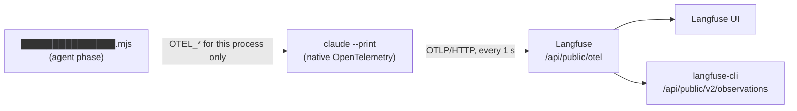

# Observability

This folder explains how to see where a walkthrough's time goes. The verification agent can
export a timed trace of every model request and tool call to a self-hosted Langfuse. People and
agents then read that trace in the Langfuse UI or with the Langfuse CLI.
ADR-0020 records the decision and the
bake-off behind it.

| Read | When |
| --- | --- |
| This page | To learn what is traced, where the credentials live, and how to turn tracing on |
| [Diagnose a run in the Langfuse UI](diagnose-in-langfuse-ui.md) | You want to look at a slow run, with screenshots of each step |
| [Diagnose a run with the CLI](diagnose-with-cli.md) | You want exact totals, comparisons between runs, or an agent to do the diagnosis |
| [Evidence](evidence/README.md) | You want the measurements behind a speed decision, or you are recording a new one |

## What is traced

Only the **agent step**: one `claude --print` invocation per run, which is "Verify ACs and capture
evidence" in CI. Packet export, readiness, initialization, validation and publishing are not
traced; their timings are the GitHub job's step durations.



Claude Code produces the spans itself. The runner only sets environment variables. There is no
hook, SDK, collector or transcript parser.

| Observation | Langfuse type | Tells you |
| --- | --- | --- |
| `claude_code.interaction` | span | The whole agent step. Its latency is the agent wall time. It arrives last, when the agent stops. |
| `claude_code.llm_request` | generation | One model call: `latency`, time to first token, and tokens in metadata (`attributes.output_tokens`, `attributes.input_tokens`, `attributes.cache_read_tokens`). |
| `claude_code.tool` | tool | One tool call: `latency`, `attributes.tool_name` and `attributes.full_command`. |
| `claude_code.tool.execution` | tool | The time the tool actually ran. A failed shell command is marked `ERROR`. |
| `claude_code.tool.blocked_on_user` | span | Time spent waiting for permission. This is near zero in unattended runs. |

Every observation carries the run's identity in its metadata:
- `resourceAttributes.ac.ticket`
- `resourceAttributes.ac.target`
- `resourceAttributes.ac.host`
- `resourceAttributes.ac.action_revision`
- `resourceAttributes.cicd.pipeline.run.id` (CI runs only; stored as a number)

**Not exported:** prompt text (shown as `<REDACTED>`), model responses, and tool output. A trace
shows what ran and how long it took, not what it returned.

**Exported:** the signed-in account's `user.email` and account IDs. Claude Code always adds these
under OAuth.

## Where it lives

| Thing | Location |
| --- | --- |
| Langfuse instance and project | Self-hosted Langfuse 4.x, project `ac-walkthrough`. Its base URL is `LANGFUSE_BASE_URL` in █████████. |
| CI write credentials | GitHub Actions secrets in `██████████-ai/██████████-Frontend-V2`: `AC_WALKTHROUGH_TRACE_ENDPOINT` and `AC_WALKTHROUGH_TRACE_HEADERS`. The workflow passes them to the action's `trace-endpoint` and `trace-headers` inputs on the agent step. |
| Read credentials | █████████ runtime project, `lab` environment, `/telemetry` folder: `LANGFUSE_PUBLIC_KEY`, `LANGFUSE_SECRET_KEY`, `LANGFUSE_BASE_URL`. |
| Agent tooling | The official Langfuse skill from [langfuse/skills](https://github.com/langfuse/skills). It drives `npx langfuse-cli`. |

Both stores hold the same Langfuse project key pair. GitHub secrets cannot be read back, so
readers use █████████.

## Set up once per machine

1. Install the Langfuse skill for Claude Code and Codex:

   ```bash
   npx skills add langfuse/skills --skill langfuse -g -a claude-code -a codex --copy
   ```

2. Log in to █████████. Take `█████████_URL` from the
   lab environment
   variables. Take `█████████_PROJECT_ID` from the runtime project's settings in █████████: the
   lab environment stores the project's slug, and the CLI needs its ID.

   ```bash
   █████████ login --domain "$█████████_URL"
   ```

3. Check access. This lists the latest run without printing any key:

   ```bash
   █████████ run --domain "$█████████_URL" --projectId "$█████████_PROJECT_ID" \
     --env lab --path /telemetry --include-imports=false --recursive=false --expand=false -- \
     npx langfuse-cli api observations list --name claude_code.interaction --limit 1 --fields core
   ```

The diagnosis guides run every CLI command under that same `█████████ run` prefix. Never print the
keys or paste them into chat.

## Turn tracing on

**CI.** The trace secrets are set in the frontend repository. A workflow that calls
`verify-preview` traces its runs once it passes the two inputs to the agent step:

```yaml
        with:
          # …the existing inputs…
          trace-endpoint: ${{ secrets.AC_WALKTHROUGH_TRACE_ENDPOINT }}
          trace-headers: ${{ secrets.AC_WALKTHROUGH_TRACE_HEADERS }}
          phase: agent
```

The action must be pinned to a release that includes ADR-0020. Older pins ignore the inputs.

**Local stored-packet runs.** The runner reads the same two settings from its environment. Build
them from `/telemetry` inside the `█████████ run` command, so the keys stay in that process:

```bash
█████████ run --domain "$█████████_URL" --projectId "$█████████_PROJECT_ID" \
  --env lab --path /telemetry --include-imports=false --recursive=false --expand=false -- bash -c '
  export AC_WALKTHROUGH_TRACE_ENDPOINT="$LANGFUSE_BASE_URL/api/public/otel"
  export AC_WALKTHROUGH_TRACE_HEADERS="Authorization=Basic $(printf "%s:%s" "$LANGFUSE_PUBLIC_KEY" "$LANGFUSE_SECRET_KEY" | base64),x-langfuse-ingestion-version=4"
  unset LANGFUSE_PUBLIC_KEY LANGFUSE_SECRET_KEY
  exec node ███████████████████████████████.mjs <the usual runner arguments>'
```

Wrap that in the runtime credentials you normally use: `█████████ run … --path /runtime -- …`, or
your saved SOPS setup. For `v2-preview`, also supply `AC_WALKTHROUGH_SESSION`,
`AC_WALKTHROUGH_HTTP_USERNAME` and `AC_WALKTHROUGH_HTTP_PASSWORD` explicitly. The runner points
`XDG_CACHE_HOME` at its workspace, so it cannot see the session that `login.mjs save-session`
cached privately, even when `login.mjs --check` passes. Local run v7 of ████████ used exactly this
setup.

## Rotate the key pair

1. Create the new pair in the Langfuse project settings.
2. Replace `LANGFUSE_PUBLIC_KEY` and `LANGFUSE_SECRET_KEY` in █████████ `lab` `/telemetry`.
3. Regenerate both GitHub secrets from █████████. The values are never printed, and the literal
   space after `Basic` is kept:

   ```bash
   █████████ run --domain "$█████████_URL" --projectId "$█████████_PROJECT_ID" \
     --env lab --path /telemetry --include-imports=false --recursive=false --expand=false -- bash -c '
     printf "%s" "$LANGFUSE_BASE_URL/api/public/otel" |
       █████████████ AC_WALKTHROUGH_TRACE_ENDPOINT --repo ██████████-ai/██████████-Frontend-V2
     printf "Authorization=Basic %s,x-langfuse-ingestion-version=4" \
       "$(printf "%s:%s" "$LANGFUSE_PUBLIC_KEY" "$LANGFUSE_SECRET_KEY" | base64)" |
       █████████████ AC_WALKTHROUGH_TRACE_HEADERS --repo ██████████-ai/██████████-Frontend-V2'
   ```

4. Delete the old pair in Langfuse.
5. Confirm with the next CI run. Its trace should appear, carrying that run's
   `cicd.pipeline.run.id`.

Use the literal space after `Basic`; that form was verified. A percent-encoded `Basic%20…` value
was not tested.

## Troubleshooting

| Symptom | Cause | Check |
| --- | --- | --- |
| No trace for a run | The workflow does not pass the inputs, the action pin predates ADR-0020, or a secret is empty | The job log prints `Agent tracing is disabled: set both …` when exactly one setting is present. |
| Job log shows `OTEL diag error: … "Unauthorized","code":"401"` | Wrong or rotated key pair, or a malformed header | Regenerate the secrets (rotation step 3). The run itself is unaffected. |
| Job log shows `OTEL diag error: … ECONNREFUSED` | Langfuse unreachable from the runner | Check that `$LANGFUSE_BASE_URL/api/public/health` returns `{"status":"OK"}`. |
| Spans but no `claude_code.interaction` | The agent is still running, or was killed before its final flush | Wait for the step to finish. Spans arrive live, and the root span arrives last. |
| A CLI read returns 404 | Langfuse 4.x events-only mode serves no v1 trace reads | Use `observations list`, which maps to `/api/public/v2/observations`. |
| A `jq` filter on the run ID matches nothing | `cicd.pipeline.run.id` is stored as a number | Compare with `tostring` or a number, not a quoted string. |

## Limits

- Token counts are metadata, not Langfuse usage, so Langfuse shows no cost. `usage.json` remains
  the cost record.
- Span names come from a beta Claude Code feature and may change when the pinned version changes.
  After an upgrade, repeat the verification checks in ADR-0020.
- Traces are diagnostics, never evidence. A failed export never changes the agent outcome, the
  report or the verification status.
