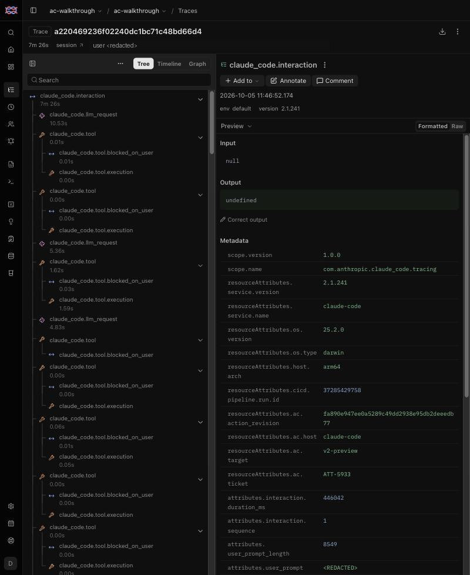
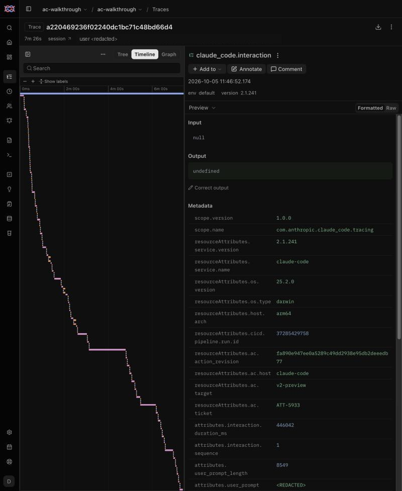
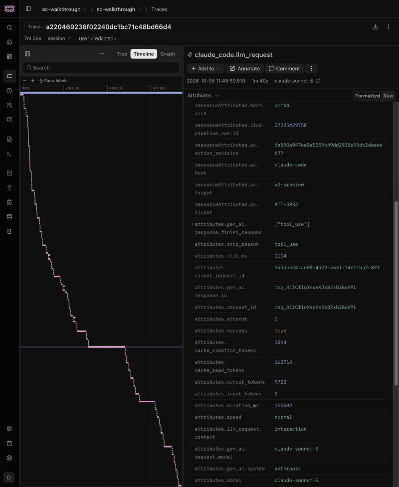
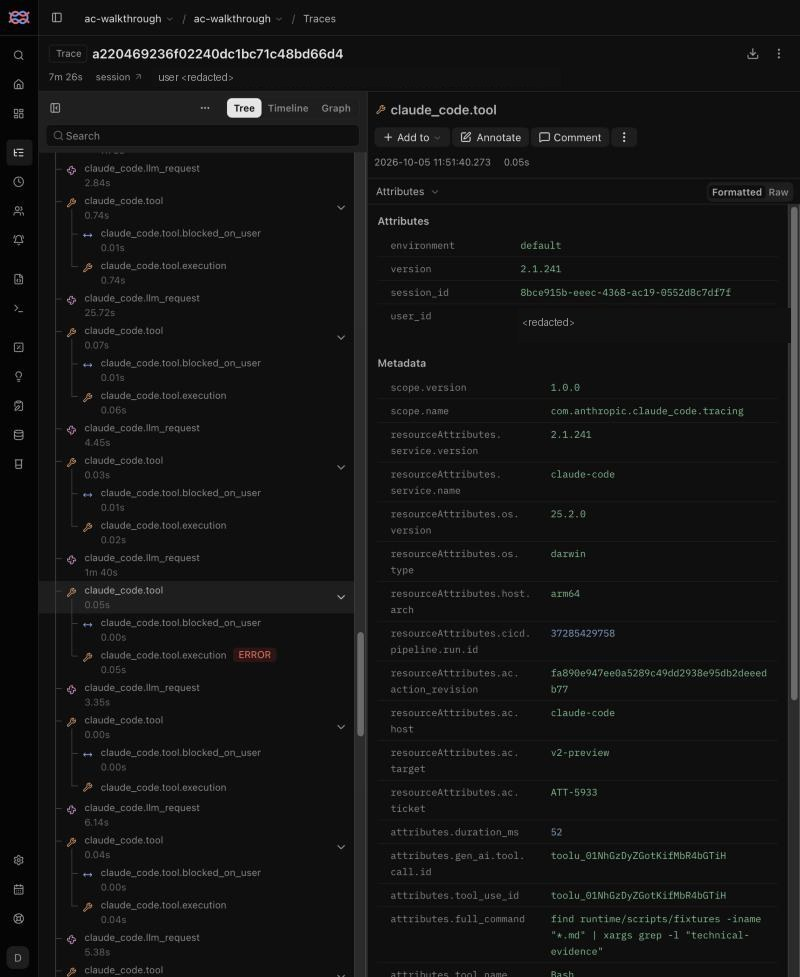

# Diagnose a run in the Langfuse UI

A step-by-step manual, recorded on a real slow-run question on 2026-10-05. The run is CI run
`███████████` of the `██████████-ai/██████████-Frontend-V2` trial workflow:
████████ on `v2-preview`, the self-hosted Mac, action revision `fa890e9`. The screenshots come from
Langfuse 4.50.0, with the user identifier redacted. The same steps work for any traced run.
[Observability](README.md) explains what the spans mean. [Diagnose a run with the
CLI](diagnose-with-cli.md) gives exact totals for the same run.

**The question:** the job took about 12 minutes, so where did the time go?

## 0. Check that the agent step is the slow part

Open the GitHub run and read the step durations. Here, **Verify ACs and capture evidence** took
459 s of about 700 s, while packet export took 66 s and publishing 55 s. Only the agent step is
traced. If another step dominates, Langfuse cannot explain it.

## 1. Find the run's slow parts

Sign in to Langfuse, open the `ac-walkthrough` project, and choose **Tracing**. Set the time range
at the top right so it covers the run, for example **Past 1 day**. Collapse the navigation with
the icon at the top left for more room.

In this deployment, the Tracing table lists observations, not traces. Type this in the search box
and press Enter:

```text
latency:>20 metadata.resourceAttributes.ac.ticket:████████
```

You can also build the same filter from the panel. Use **Latency (s)** `> 20`, then **Metadata →
Add filter** with key `resourceAttributes.ac.ticket`, `equals`, value `████████`.


**Read it.** Each run of the ticket has one `claude_code.interaction` row: 11:46:52 is the CI
run, and 11:32:20 is an earlier local run. The UI shows the browser's local time, here UTC+3.
Every other row is a model request that took over 20 s. Four of them belong to the CI run:
11:49:28, 11:49:59, 11:52:19 and 11:53:27. No tool call took over 20 s.

**First conclusion:** the slow parts are model requests, not tools.

## 2. Open the run

Click the CI run's `claude_code.interaction` row.



**Read it.**
- The header gives the agent wall time, `7m 26s`.
- The metadata ties the trace to GitHub: `resourceAttributes.cicd.pipeline.run.id` is
  `███████████`, and `resourceAttributes.ac.action_revision` is the action commit.
- The tree on the left lists the run in order: a model request, then its tool call, which has an
  execution child and a permission-wait child.
- `attributes.user_prompt` shows `<REDACTED>`: prompts are never exported.

## 3. See the shape of the run

Switch from **Tree** to **Timeline**.



**Read it.** Each bar is an observation placed on the run's clock.
- **Model-bound run:** a staircase of short steps with a few long bars. The long bars are
  generations.
- **Tool-bound run:** one wide tool bar instead. ████████ had agent-written polling loops of
  449 s and 120 s.

This run is model-bound. Its widest bar starts about 3 minutes in.

## 4. Inspect the outlier

Click the widest bar. In the right panel, switch **Preview** to **Attributes** to see its
metadata.



**Read it.** The bar is a `claude_code.llm_request` at 11:49:59, lasting `1m 40s`, on
`claude-sonnet-5`:
- `attributes.output_tokens` is `9722`;
- `attributes.duration_ms` is `100682`;
- `attributes.ttft_ms` is `1104`.

The first token arrived after about 1 s, and the rest of the 100 s was spent writing almost
10,000 tokens. **A long generation with a fast first token is a big output, not a slow API.**

## 5. See what the long request led to

Switch back to **Tree**. The selected request stays highlighted. Click the `claude_code.tool` row
directly below it, and open **Attributes**.



**Read it.**
- `attributes.full_command` is
  `find runtime/scripts/fixtures -iname "*.md" | xargs grep -l "technical-evidence"`.
- Its `claude_code.tool.execution` child is marked **ERROR**.

The agent has just drafted the report. It then looks for an example of the report format in the
fixtures and finds none. The next long requests (11:52:19 and 11:53:27) are followed by edits to
the report. A render at 11:53:07, also marked ERROR, is followed by an edit and a successful
re-render. The agent is working out the report format while writing it, and part of that is
being rejected by the renderer.

## 6. Conclude and share

| Evidence | Step |
| --- | --- |
| Slow rows are generations, not tools | 1, 3 |
| The biggest generation is a 9,722-token report draft with a fast first token | 4 |
| Format search and a render fail right after drafting, then edits follow | 5 |

**Diagnosis:** this run is model-bound. Much of its time goes into producing the report and
reworking its format. The tools (browser capture) take seconds.

**What to try next:** give the agent the report format before it starts writing, so it stops
searching fixtures and failing the first render. Measure the change with the next run of the same
ticket: there should be fewer generations after the draft, no failed render, and a shorter
`claude_code.interaction`.

**Share the evidence.** The URL in the address bar points at the selected observation
(`…/traces/<trace-id>?observation=<id>`). Paste it into the ticket or PR next to the diagnosis.

## When the shape is different

| What you see | What it means | Where to look next |
| --- | --- | --- |
| One wide `claude_code.tool` bar | The agent is waiting on a command, often a poll for the application | `attributes.full_command` on that bar; replace improvised polling with a bounded wait |
| Many short bars and no outlier | Turn count, not any one step, sets the time | Count generations with the CLI ([step 3](diagnose-with-cli.md#3-split-model-time-from-tool-time)) and reduce turns |
| Tool executions marked `ERROR` | The agent retried after failed commands | The failed command and the tool calls after it |
| Long `claude_code.tool.blocked_on_user` | The agent waited for permission | Check how the runner grants permissions; unattended runs should show near zero |
