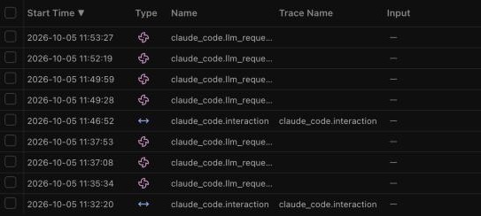
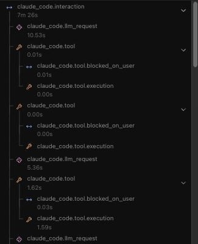
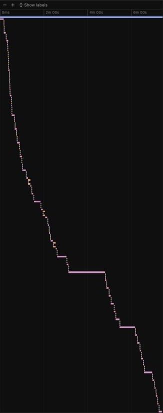

An unattended agent run that takes twelve minutes tells you nothing about why. This note explains how to get a timed trace of each model request and tool call, and how to read it.

The setup was tested with Claude Code 2.1.241 and a self-hosted Langfuse 4.x. The screenshots come from Langfuse 4.50.0.

## Why trace an agent run

A runner that starts `claude --print --output-format json` gets one result object when the agent stops. That object gives the total time and the token usage. It does not tell you where the minutes went.

Wall time alone does not separate three different causes:

- **Slow model requests.** Many turns add up, or one request writes a very long output.
- **Slow tools.** One command waits for a long time, for example a polling loop that the agent wrote.
- **Retries.** A command fails, and the agent does more turns to correct the result.

Each cause has a different fix. A trace shows which cause applies to a specific run.

## How it works



Claude Code produces the OpenTelemetry spans itself. The runner only sets environment variables, and it sets them for the agent process only. Claude Code sends the spans over OTLP/HTTP to the Langfuse endpoint `/api/public/otel`.

There is no SDK, no hook, no OpenTelemetry Collector, and no transcript parser.

To turn tracing on, start the agent with these variables. The values are placeholders. Replace the host and the Langfuse project key pair with your own.

```sh
# Build the header value from the Langfuse project key pair.
# Keep the literal space after "Basic".
AUTH="$(printf '%s:%s' 'pk-lf-…' 'sk-lf-…' | base64 | tr -d '\n')"

env \
  CLAUDE_CODE_ENABLE_TELEMETRY=1 \
  CLAUDE_CODE_ENHANCED_TELEMETRY_BETA=1 \
  OTEL_TRACES_EXPORTER=otlp \
  OTEL_METRICS_EXPORTER=none \
  OTEL_LOGS_EXPORTER=none \
  OTEL_EXPORTER_OTLP_PROTOCOL=http/protobuf \
  OTEL_EXPORTER_OTLP_ENDPOINT="https://langfuse.example.com/api/public/otel" \
  OTEL_EXPORTER_OTLP_HEADERS="Authorization=Basic $AUTH,x-langfuse-ingestion-version=4" \
  OTEL_LOG_TOOL_DETAILS=1 \
  OTEL_TRACES_EXPORT_INTERVAL=1000 \
  CLAUDE_CODE_OTEL_FLUSH_TIMEOUT_MS=15000 \
  CLAUDE_CODE_OTEL_SHUTDOWN_TIMEOUT_MS=15000 \
  CLAUDE_CODE_OTEL_DIAG_STDERR=1 \
  OTEL_RESOURCE_ATTRIBUTES="run.ticket=PROJ-123,run.target=staging" \
  claude --print "<your prompt>"
```

| Variable | What it does |
| --- | --- |
| `CLAUDE_CODE_ENABLE_TELEMETRY`, `CLAUDE_CODE_ENHANCED_TELEMETRY_BETA` | Turn on the telemetry. The trace spans are a beta feature. |
| `OTEL_TRACES_EXPORTER=otlp`, with metrics and logs set to `none` | Send traces only. |
| `OTEL_EXPORTER_OTLP_ENDPOINT`, `OTEL_EXPORTER_OTLP_HEADERS` | Send the spans to the Langfuse project, with its key pair. |
| `OTEL_LOG_TOOL_DETAILS=1` | Add the command text to each tool span. |
| `OTEL_TRACES_EXPORT_INTERVAL=1000` | Send spans every 1 s while the agent runs. |
| `CLAUDE_CODE_OTEL_FLUSH_TIMEOUT_MS`, `CLAUDE_CODE_OTEL_SHUTDOWN_TIMEOUT_MS` | Give the last spans time to arrive when the agent stops. |
| `CLAUDE_CODE_OTEL_DIAG_STDERR=1` | Write export errors to standard error, so that they appear in the job log. |
| `OTEL_RESOURCE_ATTRIBUTES` | Add the identity of the run to every span. |

If the header or the endpoint is wrong, the run continues and only the spans are lost. A trace is a diagnostic aid. It never changes the outcome of the run.

## What each observation tells you

Langfuse stores each span as an observation. A traced run has these observations:

| Observation | Langfuse type | Tells you |
| --- | --- | --- |
| `claude_code.interaction` | span | The whole agent run. Its latency is the agent wall time. It arrives last, when the agent stops. |
| `claude_code.llm_request` | generation | One model request: its latency, the time to first token, and the token counts. |
| `claude_code.tool` | tool | One tool call: its latency, the tool name, and the command text. |
| `claude_code.tool.execution` | tool | The time that the tool actually ran. A failed shell command is marked `ERROR`. |
| `claude_code.tool.blocked_on_user` | span | The time spent waiting for permission. In an unattended run, this is near zero. |

These metadata fields are the most useful:

| Field | On | Meaning |
| --- | --- | --- |
| `attributes.duration_ms` | Requests and tools | The duration in milliseconds |
| `attributes.ttft_ms` | `claude_code.llm_request` | The time to the first token |
| `attributes.output_tokens`, `attributes.input_tokens`, `attributes.cache_read_tokens` | `claude_code.llm_request` | The token counts |
| `attributes.tool_name` | `claude_code.tool` | The tool, for example `Bash` or `Edit` |
| `attributes.full_command` | `claude_code.tool` | The shell command, when `OTEL_LOG_TOOL_DETAILS=1` is set |
| `attributes.file_path` | `claude_code.tool` | The file that a file tool used |

Put the identity of the run in `OTEL_RESOURCE_ATTRIBUTES`. Use short, generic keys, for example `run.ticket` and `run.target`. In CI, also add the CI run ID, for example as `cicd.pipeline.run.id`. In GitHub Actions, set `OTEL_RESOURCE_ATTRIBUTES="run.ticket=PROJ-123,run.target=staging,cicd.pipeline.run.id=$GITHUB_RUN_ID"`. Each key then appears on every observation as `resourceAttributes.<key>`. You can filter on it in the UI and in the CLI.

## What is exported, and what is not

Claude Code does not export these items:

- **Prompt text.** The prompt attribute shows `<REDACTED>`.
- **Model responses.**
- **Tool output.**

A trace shows what ran and how long it took. It does not show what the commands returned.

Claude Code does export these items:

- **Command text**, when `OTEL_LOG_TOOL_DETAILS=1` is set. Commands can contain paths and arguments. Keep secrets in the environment, not in command arguments.
- **The identity of the signed-in account.** Under OAuth, Claude Code adds `user.email`, `user.account_uuid`, `user.account_id`, and `organization.id` to every span. As of version 2.1.241, the Claude Code documentation offers no switch that removes them from spans.

The privacy lesson: a trace is not anonymous. Send it only to a backend that you control. If the account identity must not leave the machine, remove it in an OpenTelemetry Collector before the spans reach the backend. The Langfuse UI also shows the user identifier in the trace header. Redact it before you share a screenshot.

## Diagnose a slow run in the UI

This procedure uses one real run as an example. In that run, the agent step took 459 s of a 702 s CI job. The CI step time includes more than the agent span, which took 446 s.

### 1. Make sure that the agent step is the slow part

Open the CI run and read the duration of each step. Only the agent step is traced. If a different step takes most of the time, the trace cannot explain it.

### 2. Find the slow observations

1. Sign in to Langfuse and open the project.
2. Select **Tracing**.
3. Set the time range at the top right so that it includes the run, for example **Past 1 day**.
4. Type this filter in the search box, and press Enter:

   ```text
   latency:>20 metadata.resourceAttributes.run.ticket:PROJ-123
   ```

You can also make the same filter in the filter panel. Set **Latency (s)** to `> 20`. Then add a **Metadata** filter on the key `resourceAttributes.run.ticket`.



In this deployment, the Tracing table lists observations, not traces. Each run has one `claude_code.interaction` row. The table shows two, because the filter also matches an earlier local run of the same task. All other rows are model requests that took more than 20 s. No tool call took more than 20 s. Thus, the slow parts of this run are model requests, not tools.

The UI shows times in the local time of the browser. The CLI shows UTC.

### 3. Open the run

Click the `claude_code.interaction` row of the run.



- The `claude_code.interaction` row shows the agent wall time, here `7m 26s`.
- The metadata shows the resource attributes. The CI run ID connects the trace to the CI run.
- The tree lists the run in order. A model request comes first, and then its tool call. Each tool call has an execution child and a permission-wait child.

### 4. Look at the shape of the run

Select **Timeline** instead of **Tree**. Each bar is one observation on the clock of the run.



- **A model-bound run** looks like a staircase of short bars, with some long bars. The long bars are model requests.
- **A tool-bound run** has one wide tool bar instead. In a different run, two polling loops that the agent wrote took 449 s and 120 s.

This example run is model-bound.

### 5. Examine the widest bar

Click the widest bar. In the right panel, select **Attributes** instead of **Preview**.

In the example, the bar is a `claude_code.llm_request` that took 1 min 40 s:

| Attribute | Value |
| --- | --- |
| `attributes.output_tokens` | `9722` |
| `attributes.duration_ms` | `100682` |
| `attributes.ttft_ms` | `1104` |

The first token arrived after approximately 1 s. The model used the remaining 99 s to write almost 10,000 tokens. A long request with a fast first token is a large output. It is not a slow API.

### 6. Find what the long request caused

Select **Tree** again. The selected request stays highlighted. Click the `claude_code.tool` row directly below it, and open **Attributes**.


In the example, the agent wrote a draft of its report in the long request. Then it searched the repository for an example of the report format. The search found nothing, and its execution is marked `ERROR`. Later, the first render of the report failed. The agent edited the report and rendered it again.

The diagnosis: the run is model-bound. Much of its time goes into writing the report and correcting its format. The fix is to give the agent the report format before it starts to write.

### 7. Share the evidence

The URL in the address bar points to the selected observation, in the form `…/traces/<trace-id>?observation=<id>`. Put this URL in the ticket or pull request, next to the diagnosis.

### When the shape is different

| What you see | What it means | Where to look next |
| --- | --- | --- |
| One wide `claude_code.tool` bar | The agent waits on a command, often a poll for the application. | `attributes.full_command` on that bar. Replace the improvised poll with a bounded wait. |
| Many short bars and no outlier | The number of turns sets the time. | Count the model requests with the CLI, and reduce the turns. |
| Tool executions marked `ERROR` | The agent did more turns after failed commands. | The failed command, and the tool calls after it. |
| A long `claude_code.tool.blocked_on_user` | The agent waited for permission. | How the runner gives permissions. An unattended run shows near zero. |

## Diagnose with the CLI

Use the CLI for exact totals, for comparisons between runs, or when an agent does the diagnosis. The official Langfuse skill drives `npx langfuse-cli`. To install the skill for Claude Code and Codex, run:

```sh
npx skills add langfuse/skills --skill langfuse -g -a claude-code -a codex --copy
```

The CLI reads `LANGFUSE_BASE_URL`, `LANGFUSE_PUBLIC_KEY`, and `LANGFUSE_SECRET_KEY` from the environment. Load them from your secret store for each command. Do not print the keys, and do not paste them into a chat.

To list the resources, run `npx langfuse-cli api __schema`. To list the filters and the `--fields` groups, run `npx langfuse-cli api observations list --help`.

### 1. Make sure that the agent step is the slow part

For GitHub Actions, this command prints the duration of each step:

```sh
gh run view <run-id> --repo <owner>/<repo> --json jobs \
  --jq '.jobs[0].steps[] | select(.conclusion != "skipped" and (.name | startswith("Post") | not)) | "\(.name)\t\(((.completedAt|fromdate)-(.startedAt|fromdate)))s"'
```

### 2. Find the trace of the run

```sh
npx langfuse-cli api observations list --name claude_code.interaction \
  --from-start-time 2026-10-05T00:00:00Z --fields core,metadata,metrics --limit 100 \
  | jq -r --arg t PROJ-123 '.data[] | select(.metadata["resourceAttributes.run.ticket"] == $t)
      | "\(.startTime) trace=\(.traceId) agent=\(.latency)s run=\(.metadata["resourceAttributes.cicd.pipeline.run.id"] // "local")"'
```

Each line gives a start time, a trace ID, the agent wall time, and the CI run ID. A local run shows `run=local`.

### 3. Split model time from tool time

```sh
npx langfuse-cli api observations list --trace-id <trace-id> \
  --fields core,basic,metrics --limit 1000 \
  | jq -r '.data | map(select(.name == "claude_code.interaction" or .name == "claude_code.llm_request" or .name == "claude_code.tool"))
      | group_by(.name)[] | "\(.[0].name)\t\(length)\t\((map(.latency // 0) | add) | floor)s"'
```

The output of the example run:

```text
claude_code.interaction  1   446s
claude_code.llm_request  41  403s
claude_code.tool         54  32s
```

This is the decision point. The model used 403 s of 446 s, which is 90%. The tools used 32 s. The run is model-bound, and faster tools can save 32 s at most. If the tools used most of the time, step 4 names the command to correct.

### 4. List the slowest tool calls

```sh
npx langfuse-cli api observations list --trace-id <trace-id> --name claude_code.tool \
  --fields core,metadata,metrics --expand-metadata attributes.full_command --limit 1000 \
  | jq -r '.data | map(select(.latency != null)) | sort_by(-.latency) | .[0:5][]
      | "\(.latency)s  \(.metadata["attributes.full_command"] // .metadata["attributes.tool_name"])"'
```

One tool call can contain several commands. In the example, the slowest tool call took 7.8 s, and it contained three browser-capture commands.

### 5. Find what the long model requests caused

The latency of a request is mostly the time that the model uses to write its output. To see what that output was for, pair each long request with the next tool call:

```sh
npx langfuse-cli api observations list --trace-id <trace-id> \
  --fields core,basic,metadata,metrics --expand-metadata attributes.full_command,attributes.file_path --limit 1000 \
  | jq -r '(.data | map(select(.latency != null)) | sort_by(.startTime)) as $o
      | ($o | map(select(.name == "claude_code.tool"))) as $t
      | $o[] | select(.name == "claude_code.llm_request" and .latency > 20) as $g
      | ([ $t[] | select(.startTime >= $g.endTime) ][0]) as $n
      | "\($g.startTime[11:19]) model \($g.latency)s out=\($g.metadata["attributes.output_tokens"]) → next: \($n.metadata["attributes.tool_name"] // "end") \($n.metadata["attributes.file_path"] // $n.metadata["attributes.full_command"] // "")"'
```

### 6. Find failed commands

```sh
npx langfuse-cli api observations list --trace-id <trace-id> \
  --fields core,basic,metadata --expand-metadata attributes.full_command --limit 1000 \
  | jq -r '.data as $all | $all[] | select(.level == "ERROR") as $e
      | ($all[] | select(.id == $e.parentObservationId)) as $p
      | "\($e.startTime[11:19]) \($e.statusMessage)  \($p.metadata["attributes.full_command"])"'
```

A failed execution is a child of its tool call. The command text is on the parent. If you use `--level ERROR` alone, the CLI lists the failed executions without their commands.

### 7. Compare with a second run

Do step 3 again for a second run of the same task. In the example, a local run of the same task gave this result:

| | CI run | Local run |
| --- | --- | --- |
| Agent wall time | 446 s | 506 s |
| Model requests | 41, 403 s | 51, 7.8 min |
| Tool calls | 54, 32 s | 60, 29.5 s |
| Longest model request | 100.7 s, 9,722 tokens | 1.7 min, 10,745 tokens |

The two runs have the same shape. One run can give an incorrect conclusion. Two runs that agree give a finding that you can act on.

### 8. Decide

| Evidence | Next step |
| --- | --- |
| Model-bound, with format searches and a failed render after the draft | Give the agent the output format before it starts to write. |
| One tool call that takes more than a minute | Correct that command, or give the agent a bounded wait instead of an improvised poll. |
| Neither | The number of turns sets the time. Reduce the turns, not the tool time. |

After a change, run the same task again and do steps 2 and 3. The two traces are the before-and-after evidence.

## Lessons

- **Read the CI step durations first.** Only the agent process is traced. The timings of all other steps come from the CI job, not from the trace.
- **The root span arrives last.** Spans arrive while the agent runs, and `claude_code.interaction` arrives when the agent stops. If a trace has spans but no `claude_code.interaction`, the agent is still running, or it was stopped before the last flush.
- **A fast first token means a large output.** A long model request with a time to first token of about 1 s spends its time writing. The API is not slow.
- **One tool call is not one command.** A single Bash call can contain several commands. Read `attributes.full_command` before you blame one command.
- **Use the v2 observations API.** In the events-only mode of Langfuse 4.x, a v1 trace read returns 404. Use `observations list`, which uses `/api/public/v2/observations`.
- **Some IDs are numbers.** The CI run ID is stored as a number. A `jq` comparison with a quoted string finds nothing. Use `tostring`, or compare with a number.
- **Langfuse shows no cost.** Claude Code does not use the `gen_ai.usage.*` names for its token counts. Langfuse keeps them as metadata, not as usage. Keep a separate record of cost.
- **Keep the literal space after `Basic`.** The header form `Authorization=Basic <base64>` was tested and works. A percent-encoded `Basic%20…` value was not tested. Also remove the line breaks from the encoded value: macOS `base64` does not wrap its output, but GNU and BusyBox `base64` wrap it at 76 columns.
- **Export errors go to the log.** A wrong key pair shows `OTEL diag error` with code 401. An unreachable host shows `ECONNREFUSED`. To make sure that the host responds, request `/api/public/health`. It returns `{"status":"OK"}`.
- **An unreachable endpoint makes the exit slower.** The agent can wait up to approximately 30 s when it stops: 15 s for the flush, and 15 s for the shutdown.
- **Give the trace settings to the agent process only.** Do not let the agent inherit `OTEL_*` variables from the runner environment. With tracing off, remove them. In the tested version, Claude Code also removed `OTEL_*` from the environment of its Bash tool and its hooks. Anthropic does not document this behavior.
- **Span names can change.** The spans come from a beta feature of Claude Code. Pin the Claude Code version, and make sure that the trace still works after each upgrade.
